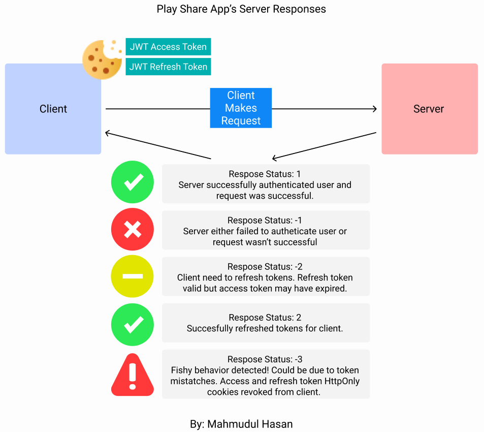

# Play Share App
# 📋 APP OVERVIEW:

* This is a Reddit/Imgur-like app where gamers can share short clips of their gameplays. 
* REST API server is built with Node, Express, MongoDB, Redis. Will migrate database to PostgreSQL in the future. Client is currently being built with React.
* Hosted a clustered REST API server on DigitalOcean and used NGINX as a reverse Proxy. Enabled HTTPS. https://playshare.cloud/ (currently disabled) 

# 💎 FEATURES:
  * **Rate Limiting** to protect against basic DDOS attacks: blocking an IP for several minutes if they make too many requests. 
  * **Session Persistence:** Keeping users logged in by silently refreshing tokens. **Combined benefits of token based and session based authentication** by using JWT access and refresh tokens and have a silent refresh scheme to persist sessions. 
  * **Client-side Protection:** Access and refresh tokens tokens are stored in HttpOnly cookies to prevent client from accessing them and can only be sent via HTTPS and same domain to guard against CSRF attacks.   
  * **Node Server Clustering and Task Threading** to increase performance of server. 
  * **TLS Handshake:** Optional TLS handshake implementation (implemented in server, deleted implementation on client).
  * **Caching** using Redis for faster response times
  * **Clean URLS:** Query parameters are passed via headers so that attackers can't query requests easily using the url. 
  * **EXIF Metadata Stripping** from images (to be implemented).
  * **Some Others:** Input validation, password hashing, saching data for frequently used endpoints, etc.

# DEMO:

    Fig 1: App security demo so far (App still in development)

      
  
<b>  What users can do:  </b>
   

  * **Users** can make a posts, edit their own posts, delete a post, see all of their posts, and like other user's posts. User feed is currently in production. Uploading video and images to S3 bucket in development. 
  * **Admin** can see all user's posts, see only a specific user's posts, and delete one or many posts by id. 
  * Users can upload image/video to Amazon S3 bucket. Users can delete their own post, can upvote/downvote posts, comment on posts. 
  * **(Future Plans)** Users can join different game groups just like reddit and follow users. App will feature an hierarchical commenting system and messaging system in the future.
 

    

# 📌 TECHNOLOGIES / DEPENDENCIES (REST API):
* The REST API Server is built using **Node**, **Express**, and **Mongoose**
* The Client side is still in production and is being built with **React**
* **Redis** - Redis is ran locally to cache user and token data for faster response times. Redis is also ran on RedisLabs Cloud Server to store tokens in a key-value database. 
* **helmet.js** - used to give some basic security to REST API application.
* **express-rate-limit** - used to limit how many requests can be made to the server in a specified time by the same IP
* **JWT** - used to authenticate a user - used to make user access and refresh tokens.
* **Joi** - used to validate request body.
* **cookie-parser** - used to parse refresh token signed cookie data from request.
* **node-rsa** - used to create asymmetric RSA keys to initiate TLS handshake between client and server. 
* **bcrypt** - used to store hashed passwords into the database.
* **crypto-js** - (not used if using HTTPS and disabling TLS) used to encrypt response and decrypt request using the client's symmetric key (AES).
* **morgan** - used to log endpoint response times. 

# 🚑 SERVER RESPONSE CODES:
  

    
  

  

    Fig 2: Responses of the API Server: 1, -1, -2, 2, -3
  

  | Server Response Codes | Description             | Client Action | 
  | ---------------------| -----------              | ------------- | 
  | 1                    | Request successful       |  |     
  | -1                   | Request unsuccessful     |  Read the response message|     
  | -2                   | Need to refresh tokens       |  Needs make a request to the `/refresh` endpoint and supply refresh token
  | 2                    | Successfully refreshed tokens   | Need to make previous request again |
  | 3                    | Request unsuccessful. Fishy behavior was detected and tokens are deleted from client | Neeed to login again     
     

# 🏠 RUN SERVER LOCALLY:
1) Rename ***.env.example*** to ***.env***. Variables marked with a `*` must be changed to connect to MongoDB, Redis, and AWS cloud services.
    
      
      
 Description of the enviornment variables 

    
      * `ADMIN_USERNAME` - Email address of the admin account.
      * `SALT_NUM = 10` - Can keep this as is. This is the salt number to hash the password and the JWT User Secret Key to store in the database. Can change this number every year to change 
      the hashing algorithm of these fields.
      * `USE_TLS = false` - Can keep this as is. Do you want to use the TLS handshake? false = disable TLS (do this when using https). true = enable TLS. 
    
      * 
      
        
 KEYS 

        * `ADMIN_SECRET_KEY` - This will be used to make the admin's access JWT
        * `USER_SECRET_KEY`  - This will be used to make the admin's and user's access JWT
        * `REFRESH_TOKEN_SECRET` - This is used to generate a refresh JWT refresh
        * `COOKIE_SECRET` - This is used to sign HttpOnly cookies
        * `JWT_PAYLOAD_ENCRYPTION_KEY` - Used to encrypt the JWT payload. Payload contains the username and a random number, which together, lets the server find the refresh key value in the database in linear time. 
        

      * 
      
        
 MongoDB 

        * `* DB_CONNECT`  - Store your MongoDB Connection
        

      * 
      
        
 Redis Labs 

        * `REDIS_LOCAL_PORT` - redis local server port
        * `* REDIS_CLOUD_PORT` - redis cloud server port
        * `* REDIS_CLOUD_HOST` - redis cloud server url
        * `* REDIS_CLOUD_PASSWD` - redis cloud server password
        

      * 
      
        
 AWS 

        * `* S3_BUCKET_NAME` - S2 bucket name
        * `* DYNAMODB_TABLE_NAME` - DynamoDB table Name (might delete as redislabs replaces it in code) 
        * `* AWS_ACCESS_KEY_ID` 
        * `* AWS_SECRET_ACCESS_KEY`
        

    

2) `redis-server` - download redis and start the redis server for REST API. Connect to the local Redis database by using the CLI: `redis-cli`. Connect to RedisLabs cloud database by running `redis-cli -h "<REDISLABS_URL>" -p <PORT> -a "<PASSWORD>"`
3) `npm install` on the **CLIENT** & **SERVER** directories
4) `npm start` on the **CLIENT** & **SERVER** directories to run the client and server 

# 🛡️ APP SECURITY:

      
  
 APP SECURITY SUMMARY 

  * **Rate Limiting** Limited requests to 100 requests every 10 minutes. This will guard against simple DDOS attacks by rating how many requests can be made in a specific time by the same IP.
  * **Input Validation** with **Joi**.
  * **Passwords are hashed and stored in database:**
  * **Long Secret Keys:** The secret keys needed to make tokens, cookies, and hash passwords are 700-1200 characters long and are stored in the **.env** file. The keys are created using concatenations of several randomly generated hashes. 
  * **Session Persistence:** Application can keep users logged in if the client supplies the correct refresh token HttpOnly cookie and the correct `username` header. 
  * **Cors & Helmet Protections:** **Cors** and **helmet.js** middlewares provide some basic security to server.
  * **HttpOnly Cookies:** Token cookies are HttpOnly cookies with flags set to `httpOnly:true`, `secure:true`, `sameSite:strict` to ensure the client cannot read its contents and cookies can only be transmitted via https and can only send to the same domain to guard against CSRF attacks. 
  * **Token Expire Times:** Access token and its cookie expires in 5 minutes. Refresh token and its cookie expires in 15 days. 
  * **TLS:** (optional if using TLS) All data in requests and responses are AES encrypted by the symmetric key. Api automatically decrypted request with symmetric key.
  

  ## 🍪 A) Authentication via JWT Access & Refresh Tokens + Silent Refresh to Persist Sessions:
  
  

    Fig 3: Silent Refresh Process to persist user session. Server will refresh access and refresh tokens if client pass all requirements. 
  

  * After successful login, access token and refresh tokens are made and stored in a signed HttpOnly cookie so that they cannot be accessed in the client. Can silently refresh tokens to persist sessions with: (1) valid refresh token, and (2) corresponding username in the `username` header of the request. 
  
      
  
<b>🍪 Token & Cookie Creation + Expiration Times: </b>

  * **Secret Keys:** 
    * **Access token** is signed with the `USER_SECRET_KEY` key if its a user or the `ADMIN_SECRET_KEY` key if it is an admin. 
    * **Refresh token** is signed with the `REFRESH_TOKEN_SECRET` key.
    * Tokens are AES encrypted with `JWT_PAYLOAD_ENCRYPTION_KEY`. 
    * **HttpOnly cookies:** Access and Refresh tokens are stored in individual HttpOnly cookies. The cookies are signed with `COOKIE_SECRET`. Can only be sent via HTTPS and to the same domain/subdomain. 
  * **Token Payload:** The payload of the tokens is the username along with a randomly generated number. Example: `{username: 'Tom', id: '1234'}`
  * **Expiration Times:** 
    * **Access Token & HttpOnly Cookie** expiration time: 5 minutes
    * **Refresh Tokens& HttpOnly Cookie** expiration time: 15 days
  
 
   
  | Token Name             | Type        | Encryption Key (JWT)    | Payload Encryption Key (AES) | Expiration 
  | -----------------      | ----------- | ----------------------- |  --------------------------- | ---------- 
  | User Access Token JWT  | JWT         | `USER_SECRET_KEY`       | `JWT_PAYLOAD_ENCRYPTION_KEY` | 5 min       
  | Admin Access Token JWT | JWT         | `ADMIN_SECRET_KEY`      | `JWT_PAYLOAD_ENCRYPTION_KEY` | 5 min
  | Refresh Token JWT      | JWT         | `REFRESH_TOKEN_SECRET`  | `JWT_PAYLOAD_ENCRYPTION_KEY` | 15 min

  | Cookie Name            | Cookie Signature | Flags                                         | Expiration | 
  | -----------------      | -----------      | --------------------------------------------- | -----------
  | Access Token Cookie    | `COOKIE_SECRET`  | `httpOnly`, `secure`, `sameSite`, `signed`    | 5 min
  | Refresh Token Cookie   | `COOKIE_SECRET`  | `httpOnly`, `secure`, `sameSite`, `signed`    | 15 min
   

  
   
  
<b>🤫 Silent Refresh Procedure to Persist Sessions</b> (Figure 3):  

  1) When a request has an invalid access token, the server will verify if the refresh token is valid. If it is valid, the server will respond with status code `-2`. 
  2) Client will send a GET request to the `/auth/refresh` endpoint. 
  3) Server will decrypt the refresh token and will get the `username` and `id` fields from the payload. It will fetch the value of `username-id` from the database. If the incoming refresh token matches the token saved in the database, and the `username` header matches the `username` payload field of the token, the server will try to refresh the tokens.
  4) If the server successfully refreshed the tokens, it will respond with status code `2` and will delete the token from the database and will add the new token to the database. If unsuccessful, server will respond with `-1`.
  
  

  
       
  
<b>Authentication & Authorization </b> 

  * Multiple checks to authenticate user: 
  1) Validating access and refresh tokens. 
  2) Matching token payloads with username header to ensure that the correct user is using the token. 
  3) Checking if user is in the database
  4) Checking if refresh token is in database (used request is trying to access admin routes, when refreshign tokens, or when access token is invalid)

  

## 🤝 B) TLS handshake (optional, disabled by default since using https):
  
  

    Fig 4: TLS Handshake I implemented on the server. Client in development.
  

  * TLS handshake can be performed but is not needed since server and client will communicate over https. Implemented basic version of TLS for fun
  
      
    
<b> TLS Handshake Process</b> 

  1. Client sends initial request to server (/auth/ routes only).
  2. Server generates RSA public and private keys and send to public key to client:
    * 1) header `handshake` = 0
    * 2) header `pub_key` = public key
  3. Client generates a random hash (`SYMMETRIC_KEY`) and encrypts with public key and sends request to server with two headers: 
    * 1) header `handshake` = 0
    * 2) header `key` = `SYMMETRIC_KEY` encrypted with public key
  4. Server will then decrypt the `SYMMETRIC_KEY` with the private key and will send a response with header `handshake` = 1, signifying handshake completed for server.
  5. Client will finish by sending a request with header `handshake` = 1, signifying it has received the server's message
  6. Server will only fulfill requests for auth routes if the `handshake` header is set to 1. This means that server has the client's `SYMMETRIC_KEY` and can decrypt request. If server cannot decrypt request, the `SYMMETRIC_KEY` is incorrect and server will refuse request. 
  7. Symmetric keys are stored in a dictionary in the server (will move it to a key-value database). If user logs out, entry is deleted

  

# 📐 USABILITY (CLIENT REQUESTS):

      
  
<b> Client Headers </b>  

* To make any requests to the server, the application needs to have the valid access key.
* `Content-Type` = `application/json`
* `username` = username. this username will be compared to the username in the tokens to authenticate user
* `post-id` = client will specify the post id here to edit the specific post
* `like-dislike` = `"like"` or `"dislike"`
* (optional if using TLS): `handshake` =  
  * nothing - to initiate TLS handshake
  * `0` - to  say sending client's symmetric key to server 
  * `handshake_index` - this number is sent by server after successful TLS handshake. Client will make requests with this handshake
* (optional if using TLS): AES encrypt the body and specific headers of the request or response with the symmetric key

  